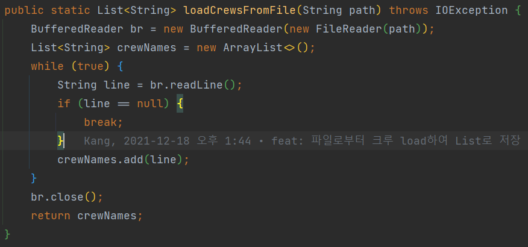
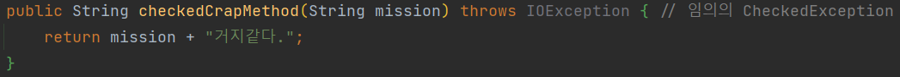
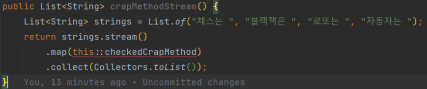
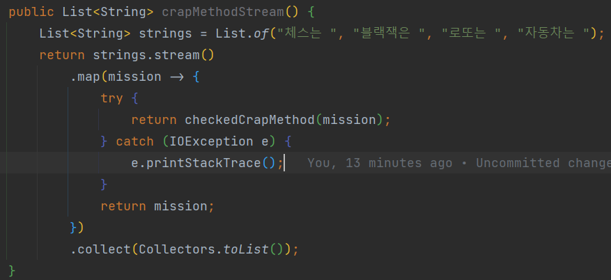
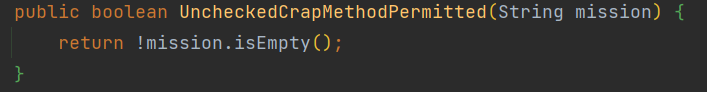
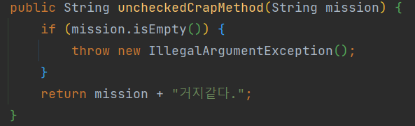
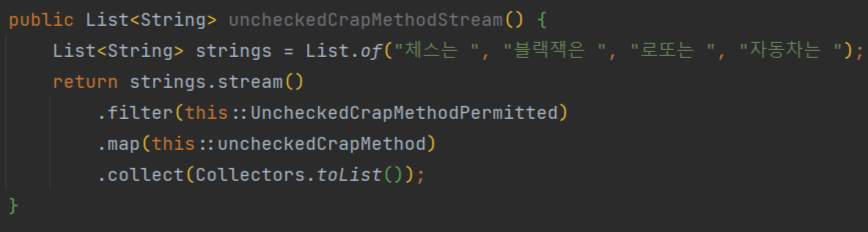
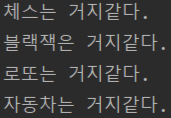

# 웬만하면 비검사 예외다. 기억하자.
`소주캉`

## 예외 종류 너무 많아!😵‍💫 차이가 뭔데? 
### Error
- JVM 자원 부족, 불변식 깨짐 등 개발자가 미리 대응할 수 없는 상황
  - ThreadDeath
  - VirtualMachineError
    - OutOfMemoryError
    - StackOverFlowError
  - IOError

### Exception
#### 실질적인 CheckedException
- 호출하는 쪽에서 복구 가능하다고 믿을 때 
- 예외 상황의 정보를 알려주는 메서드를 함께 제공해야 한다(접근자)
  - IOException
  - 우테코 마지막 코딩테스트 `그놈`
  - 
  - SQLException
  - BrokenBarrierException
#### RuntimeException
- 그외 Runtime에서 발생하는 프로그래밍 오류
- Client가 예외 상황에서 복구할 방법이 없을 때

## 왜 검사 예외 쓰지 말라는 거지?🤔
- 임의의 검사 예외를 던질 수 있도록 한 메서드를 가정하자.
  - 
### 검사 예외를 던지는 메서드는 스트림에 사용할 수 없다.
- 
### 더러운 try-catch 블록 추가해야 한다.
- 

## 검사 예외를 어떻게 비검사 예외로 바꾸지? 
### 옵셔널을 반환한다. 
- [써머의 ITEM 55, 옵셔널 반환은 신중히 하라](https://github.com/woowacourse-study/2022-daily-effective-java/blob/main/handbook/08/55.%20%EC%98%B5%EC%85%94%EB%84%90%20%EB%B0%98%ED%99%98%EC%9D%80%20%EC%8B%A0%EC%A4%91%ED%9E%88%20%ED%95%98%EB%9D%BC.md)
- 옵셔널로 반환하면 검사 예외를 없애고 멀티 스레드 상황 등 상태가 변할 위험에 안정적이다.

### 상태 검사 메서드, 상태 의존 메서드 분리
#### 상태 검사 메서드란? 
- `Iterator.hasNext`같이 상태에 의존하는 메서드가 수행 가능한 상태인지 검증해주는 메서드
- 이전의 `CheckedCrapMethod`에서 상태 검사 메서드 분리
  - 
#### 상태 의존 메서드란? 
- `Iterator.next`와 같이 상태의 의존하여 수행 성공 여부가 결정된 메서드 
- 이전의 `CheckedCrapMethod`에서 상태 의존 메서드 분리
  - 
#### 더 깔끔하고 스트림에서도 사용할 수 있다. 
- 
- 부작용
  - 상태 검사 -> 상태 의존 메서드 호출 사이 멀티 스레드, 외부 요인에 의해 상태 변경 가능성 있음
### 이거 보여주려고 어그로 끌었다.
- 실행 결과
- 

## 결론: 웬만하면 비검사 예외다. 기억하자.
- 검사 예외는 `더럽다`.
- 꼭필요한 곳에만 사용하여 안정성을 높이자.
- 일반적으로 `클라이언트가 복구할 방법이 없다면 비검사 예외`를 던지자.
- `복구가 가능`하고, `클라이언트가 그 처리를 해줘야 한다`면 `우선 옵셔널을 생각`하자.
- `그게 불가능 할때만 검사 예외`를 던지자.

## 참고
- [예외의 분류](https://lh5.googleusercontent.com/WqqNoyFEkZXfmZBBQjgIutY72_BUV6_By_BAe7Ih9u36HfelS3nTWQEYtdRUkQS32Tuhg9P9CUXo-jgvOpkO84vLm2viI4Od0BNustwONdMm7DKZnKC6kyVHyRJbsESLIPV4uBU)
