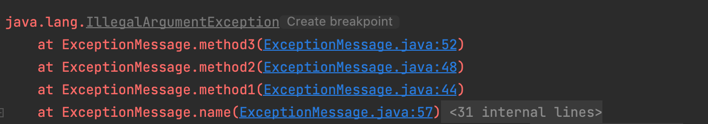
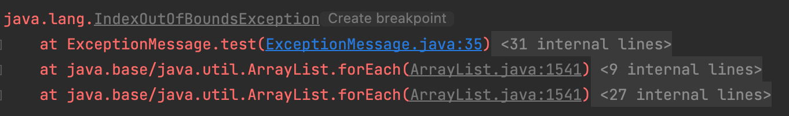
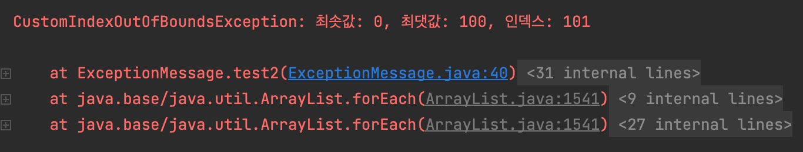

# 75. 예외의 상세 메시지에 실패 관련 정보를 담으라



스택 추적 (Stack trace) 정보는 실패가 발생했을 때 프로그래머가 얻을 수 있는 유일한 정보인 경우가 많다. 실패를 재현하기 어렵다면 실패에 대한 자세한 정보를 얻기 더더욱 어려울 수 있다.

스택 추적 정보는 예외 객체의 `toString` 을 호출해 얻는 문자열이다. 예외의 `toString` 메서드에 실패 원인에 대한 정보를 가능한 많이 담아 반환하는 것이 중요하다.

즉, 실패 순간을 포착하기 위해 발생한 예외에 관여된 모든 매개변수와 필드의 값을 실패 메시지에 담아야한다. 예외 상세 메시지에 관련된 데이터를 모두 담아야한다.

다만 파일 이름, 줄 번호 등 소스코드에서 직접 얻을 수 있는 정보와 같은 정보는 필요 없다. 그리고 비밀번호나 암호 키 같은 보안에 민감한 정보는 담아서는 안된다.

또한 예외의 상세 메시지는 최종 유저에게 보여줄 오류 메시지가 아니다. 이를 혼동해서는 안된다. 따라서, 메시지의 가독성 보다는 담긴 내용이 훨씬 중요하다.

## 표준 예외에 실패 관련 정보 담기

### 기존의 IndexOutOfBoundsException



```java
public class IndexOutOfBoundsException extends RuntimeException {
    private static final long serialVersionUID = 234122996006267687L;

    public IndexOutOfBoundsException() {
        super();
    }

    public IndexOutOfBoundsException(String s) {
        super(s);
    }

    public IndexOutOfBoundsException(int index) {
        super("Index out of range: " + index);
    }
}
```

자바 9이전의 `IndexOutOfBoundsException` 은 String 을 문자열로만 받는다.

> 자바 9부터 정수 index 를 받아 메시지를 만드는 생성자가 생겼지만, 최솟값과 최댓값 등의 상세한 정보는 받지 않아 조슈아 블로크씨는 아직 불-편 하시다고 한다.

### 실패 관련 정보가 담긴 커스텀 IndexOutOfBoundsException

조슈아씨의 조언을 적극반영하여, `IndexOutOfBoundsException` 을 상속한 `CustomIndexOutOfBoundsException` 를 만들어보자.

```java
class CustomIndexOutOfBoundsException extends IndexOutOfBoundsException {
    private final int lowerBound;
    private final int upperBound;
    private final int index;

    public CustomIndexOutOfBoundsException(int lowerBound, int upperBound, int index) {

        // 실패를 포착하는 상세 메시지를 생성한다.
        super(String.format("최솟값: %d, 최댓값: %d, 인덱스: %d", lowerBound, upperBound, index));

        // 프로그램에서 이용할 수 있도록 실패 정보를 저장해둔다.
        this.lowerBound = lowerBound;
        this.upperBound = upperBound;
        this.index = index;
    }

    public int getLowerBound() {
        return lowerBound;
    }

    public int getUpperBound() {
        return upperBound;
    }

    public int getIndex() {
        return index;
    }
}
```

### 어떤 점이 개선되었을까?



1. `super` 를 사용하여 `IndexOutOfBoundsException` 의 생성자에 상세 실패 정보를 문자열로 전달하였음.
2. 예외 실패와 관련된 정보를 얻을 수 있는 접근자 메서드 `getLowerBound`, `getUpperBound`, `getIndex` 를 제공한다.

   따라서 예외 상황을 복구하는데 유용할 수 있으므로 접근자 메서드는 비검사 예외보다는 검사 예외에서 더 빛을 발한다.
